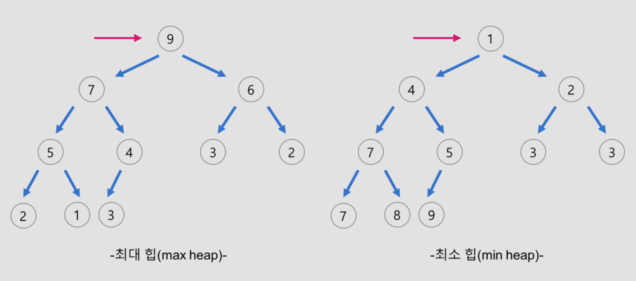

# 자료구조
## 스택(Stack)

### 개념
- 입력 받은 값을 순차적으로 쌓아서 저장
- 한 쪽 끝으로만 자료를 넣고 뺌
  ➡️ **LIFO(Last In First Out)** 형식의 자료구조
- 스택의 top 값은 -1

### 시간 복잡도
- **삽입, 삭제**: O(1)
- **검색**: O(N)

### 용어
- **push**: 최상위에 데이터 저장 후 반환
- **pop**: 최상위 데이터 삭제 후 반환
- **peek**: 최상위 데이터 조회 후 반환, size가 0이라면 EmptyStackException 던짐
- **empty**: stack의 size가 0이라면 true를 반환
- **search**
  - 메서드의 인자를 스택에서 검색해 해당 위치를 반환
  - 만약 해당 인자가 여러 개일 경우, 마지막 위치를 반환
  - 여기서 위치는 인덱스가 아닌 빠져나오는 순서를 뜻함    
    - e.g. 1, 2, 4, 3 순으로 push 했다면 search(3)은 1을 반환  
    - e.g. 1, 2, 2, 4 순으로 push 했다면 search(2)은 2를 반환
  - 찾는 값이 스택에 없으면 -1을 반환

### 활용 예시
- 웹 브라우저 뒤로 가기
- 역순 문자열 만들기
- 재귀적 알고리즘(ex: Factorial, DFS)

 

## 큐(Queue)
### 개념
- 입력 받은 값을 줄 세워서 저장
- 먼저 넣은 데이터가 먼저 나옴
  ➡️ **FIFO(First In First Out)** 형식의 자료구조
- head와 tail을 가지고 있음

### 시간 복잡도
- **삽입**: O(1)
- **삭제**: O(1)
- **`front`와 `(tail - 1)`의 원소 조회**: O(1)
  - `front`와 `tail - 1`이 아닌 나머지 원소들은 확인/변경이 원칙적으로 불가능

### 용어
|  |    예외     |   값 반환   |
|:--:|:---------:|:--------:
| 삽입 |  add(e)   | offer(e) |
| 삭제 | remove()  |  poll()  |
| 조회 | element() |  peek()  |

**삽입 (위치: `tail - 1`)**
- **add**: 큐가 꽉 찬 경우 IllegalStateException 던짐
- **offer**: 큐가 꽉 찬 경우 false 반환

**삭제 (위치: `head`)**
- **remove**: queue가 비어있는 경우 NoSuchElementException 던짐
- **poll**: queue가 비어있는 경우 null 반환

**조회 (위치: `head`)**
- **element**: queue가 비어있는 경우 NoSuchElementException 던짐
- **peek**: queue가 비어있는 경우 null 반환

### 활용 예시
- 줄을 서서 기다려야 하는 모든 행동 (ex: 은행 업무, 놀이동산 줄)
- 프로세스 관리
- 너비 우선 탐색 (Breadth-First Search)

 

## 덱(Deque)
### 개념
- 양쪽 끝에서 삽입, 삭제 가능
- 배열 또는 연결 리스트로 구현 가능 -> 배열로 구현하는 게 더 쉬움
- head(가장 앞에 있는 원소의 인덱스)와 tail(가장 뒤에 있는 원소의 인덱스 + 1)을 가지고 있음
- head와 tail의 초기값은 0이 아닌 Max
- 
### 시간 복잡도
- 삽입: O(1)
- 삭제: O(1)
- 제일 앞/뒤의 원소 조회: O(1)
  - 제일 앞/뒤가 아닌 나머지 원소들의 확인/변경이 원칙적으로 불가능

### 용어

**`First Element(Head)`**

| |      예외       |     값 반환      |
|:-------------------:|:-------------:|:-------------:
|         삽입          |  addFirst(e)  | offerFirst(e) |
|         삭제          | removeFirst() |  pollFirst()  |
|         조회          |  getFirst()   |  peekFirst()  |

**`Second Element(Tail)`**

|  |      예외      |     값 반환     |
|:--------------------:|:------------:|:------------:
|          삽입          |  addLast(e)  | offerLast(e) |
|          삭제          | removeLast() |  pollLast()  |
|          조회          |  getLast()   |  peekLast()  |

**삽입**
- **addFirst**, **addLast**: deque이 꽉 찬 경우 IllegalStateException 던짐
- **offerFirst**, **offerLast**: 삽입이 가능한 경우 true 반환, deque이 꽉 찬 경우 false 반환, 

**삭제**
- **removeFirst**: head 값 반환, deque이 비어있는 경우 NoSuchElementException 던짐
- **removeLast**: tail 값 반환, deque이 비어있는 경우 NoSuchElementException 던짐

- **pollFirst**: head 값 반환, deque이 비어있는 경우 null 반환
- **pollLast**: tail 값 반환, deque이 비어있는 경우 null 반환

**조회**
- **getFirst**: head 값 반환, deque이 비어있는 경우 NoSuchElementException 던짐
- **getLast**: tail 값 반환, deque이 비어있는 경우 NoSuchElementException 던짐

- **peekFirst**: head 값 반환, deque이 비어있는 경우 null 반환
- **peekLast**: tail 값 반환, deque이 비어있는 경우 null 반환

 

## 힙(Heap)
### 개념
- 단어적으로는 무언가 차곡차곡 쌓아둔 더미
- 완전 이진트리의 일종
- 우선 순위 큐를 위해 만들어진 자료구조
- 데이터들이 우선 순위를 가지고 있어서 "우선 순위가 높은 순서대로" 나감
- 힙으로 우선 순위 큐를 구현하면 삽입, 삭제에 걸리는 시간 복잡도는 O(logN)

**완전 이진트리**
- 부모-자녀처럼 계층적인 형태를 가지는 구조
- 단 두개의 자식 노드만 가지는 이진트리
- 노드가 왼쪽부터 차례대로 채워지면 완전 이진트리

### 규칙
- 삭제: 가장 우선순위가 높은 데이터를 빼낸 후 마지막 노드를 루트 노드 자리에 옮김
- 좌측 자식 index = 부모의 index x 2
- 부모는 자식 index % 2
- 우측 자식 index = 부모의 index x 2 + 1

### 우선순위 큐(Priority queue)와 힙(Heap)의 관계
- 힙의 키를 우선순위로 사용한다면 힙은 우선순위 큐의 구현체가 됨
- **우선순위 큐(Priority queue)**: ADT(Abstract Data Type)
  - 말 그대로 "우선순위 + 큐"
  - 큐와 유사하지만 FIFO 대신 데이터들의 우선순위에 따라 값을 먼저 내보냄
  - 우선 순위 큐는 힙으로 구현하는 게 가장 효율적
- **힙(Heap)**: data structure

### 종류

- **최대 힙(Max Heap)**: 부모 노드의 key가 자식 노드(들)의 key보다 **크거나 같은** 트리  
- **최소 힙(Min Heap)**: 부모 노드의 key가 자식 노드(들)의 key보다 **작거나 같은** 트리

### 왜 힙이 효율적인가?
- 힙은 항상 우선 순위가 높은 값이 상위에 있음
- 따라서 원소를 추가/삭제할 때도 항상 이 규칙이 지켜져야 함
  - 왼쪽 자식과 오른쪽 자식은 부모보다 작기만 하면 됨
  - 힙 트리는 중복 값을 허용

### 활용 예시
- 프로세스 스케줄링
- 힙 정렬(Heap Sort)
- 네트워크 트래픽 제어
- N번째로 큰 숫자 구하기